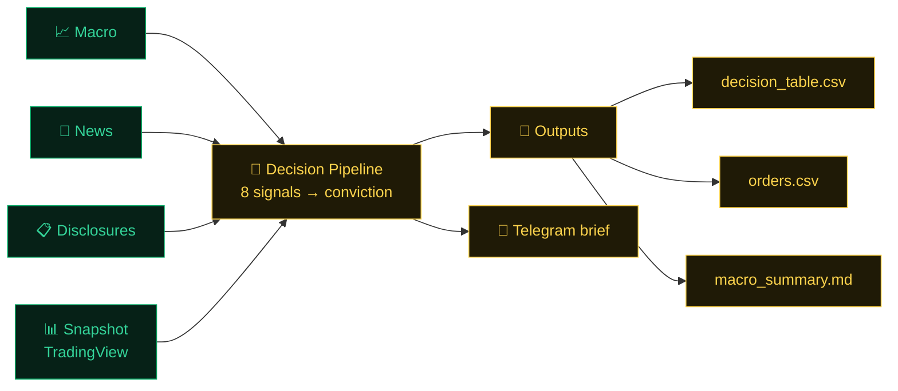

<div align="center">



<br/>

### Institutional-grade equity intelligence for the Nigerian Exchange.

**Eight research signals. One explainable conviction score. Delivered to your phone before the opening bell.**

<br/>


[Why](#-the-gap) · [Features](#-what-you-get) · [Conviction Score](#-the-conviction-engine) · [Pipeline](#-the-daily-pipeline) · [Quickstart](#-quickstart)

</div>

---

## 🌍 The gap

Global markets have Bloomberg, FactSet, and armies of sell-side analysts. **The Nigerian Exchange has a spreadsheet and a WhatsApp group.**

Over 150 listed companies. Real earnings, real disclosures, real dislocations, and almost no systematic coverage. Retail and boutique investors are left reading PDFs at midnight, reacting to news that already moved the price, and sizing positions on gut feel.

**NaijaAlphas closes that gap.** It's a complete research desk in software: it ingests everything the market publishes, scores every listed name on eight independent dimensions, fuses them into a single explainable conviction number, sizes a portfolio around it, then lands the whole thing in your Telegram before the market opens.

## ⚡ What you get

| | |
|---|---|
| 📥 **Total market ingestion** | TradingView fundamentals & scanner, AssessWorth, NGX corporate disclosures, annual reports, Proshare research, earnings forecasts, news, and Nigerian macro, all pulled automatically. `ingest/` |
| 🧮 **Eight-dimension research** | Fundamental · technical · quality · seasonality · disclosure · report tone · news sentiment · market context. Every listed name, every day. `analysis/` |
| 🎯 **One conviction number** | All eight signals fused into an explainable **0–100 score with a clear action**: STRONG_BUY, ADD, HOLD, TRIM, SELL, AVOID. `decision_system/` |
| 💼 **Portfolio construction** | Conviction-weighted sizing that turns scores into a concrete **BUY / TRIM / SELL order list** against your capital. `portfolio.py` |
| 🤖 **Delivered to your phone** | An LLM-powered Telegram bot that answers questions about your holdings, pushes the daily brief, and formats it for humans. `notify/` |
| 📓 **Deep-dive notebooks** | Momentum ranking, hidden gems, blue-chip quality, stop-loss tracking: the analyst workbench. `notebooks/` |

## 🎯 The conviction engine

Most "AI stock pickers" hand you a number and hope you don't ask how. **NaijaAlphas shows its work, every time.**

```
  8 signals ──▶ weighted fusion ──▶ macro tilt ──▶ confidence shrink ──▶ CONVICTION 0–100 + ACTION
```

Four decisions make it trustworthy:

1. **Missing data is excluded, never zero-filled.** A stock with no news coverage isn't punished with a 0. Weights re-normalize across only the signals that actually have data.
2. **Thin coverage gets pulled toward neutral.** Confidence shrinkage means a barely-covered small-cap can't produce a wild 95 off one lucky datapoint.
3. **Macro regime tilts, bounded.** The Nigeria macro picture shifts sector weightings, but within a hard cap, so the model can never be hijacked by one input.
4. **Deliberately no black-box ML.** With ~30 historical snapshots, a model would fit noise. The weighted scheme is **auditable, explainable, and calibratable**, and it's validated against realized forward returns (`calibration.py`).

Every score ships with its sub-scores, its confidence, and its reasons. You can always answer *"why is this a BUY?"*

## 🔄 The daily pipeline

One command. Every step failure-isolated: a dead news source degrades the run, it doesn't kill it.



```bash
python daily_ingest.py --capital 1000000
```

**Ships four artifacts to `outputs/decisions/<date>/`:**

| File | What's in it |
|---|---|
| `decision_table.csv` | Every stock: conviction, action, all 8 sub-scores, confidence, reasons |
| `orders.csv` | The concrete BUY / TRIM / SELL list |
| `macro_summary.md` | Macro regime + active sector tilts |
| `run_manifest.json` | Run stats, degraded sources, weight-set version |

## 🏗️ Architecture

```
daily_ingest.py    the daily pipeline entry point
decision_system/   the conviction engine: signals, confidence, macro regime,
                   conviction fusion, portfolio construction, calibration
analysis/          research modules: fundamental, quality, growth, seasonality,
                   sentiment, hidden gems, disclosures, backtest
ingest/            data acquisition: TradingView, AssessWorth, NGX disclosures,
                   annual reports, Proshare, news, macro
notify/            Telegram bot: LLM agent, server, formatter, registry
notebooks/         analyst workbench: momentum, gems, quality, stop-loss
tools/             scheduled-task + service installers, strategy runner
docs/              methodology write-ups and codebase architecture
core/ config/ utils/   models, settings, visualization
tests/             pipeline, decision-system, and scoring test suite
```

Screeners, backtests, and snapshot utilities ship at the repo root
(`find_gems_v2.py`, `backtest_momentum.py`, `quality_growth_screen.py`,
`create_snapshot.py`, and more).

**Engineered to run unattended:** failure-isolated pipeline steps, a run manifest that records exactly which sources degraded, and a scheduled-task installer for daily execution.

## 🚀 Quickstart

```bash
pip install -r requirements.txt
cp .env.example .env        # add your Telegram bot token
python daily_ingest.py --capital 1000000
```

`Python 3.11` · pandas · Telegram Bot API · local LLM via Ollama · pytest

## ⚠️ Important

**NaijaAlphas is research software, not financial advice.** It surfaces and scores information. Every output is a starting point for your own analysis, and you are responsible for your own capital.


## 📄 License

MIT © [Christian Onyekwe](https://github.com/miztachristian)
